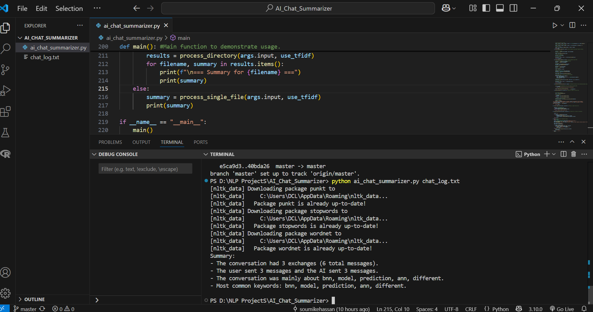

# AI Chat Log Summarizer

A Python-based tool that analyzes chat logs between users and AI assistants, providing summaries with message statistics and key topic identification.

## Overview

AI Chat Log Summarizer parses .txt files containing conversations between users and AI assistants. It extracts valuable insights including:

- Total message counts (overall and per participant)
- Number of conversation exchanges
- Top keywords using basic NLP techniques
- Conversation topic identification

The tool uses natural language processing to filter out common stop words and focus on meaningful content, providing a quick understanding of what the conversation was about.

## Features

- **Robust Chat Parsing**: Handles multi-line messages and different chat formats
- **Comprehensive Statistics**: Counts messages by speaker and total exchanges
- **Smart Keyword Extraction**: Two methods available:
  - Simple frequency-based analysis
  - TF-IDF for more sophisticated keyword identification
- **Batch Processing**: Option to summarize multiple chat logs from a directory
- **Easy to Use**: Simple command-line interface

## Requirements

- Python 3.6+
- Required packages:
  - nltk
  - scikit-learn

## Installation

1. Clone this repository or download the script:

```bash
git clone https://github.com/soumikehassan/AI-Chat-Log-Summarizer.git
cd AI-Chat-Log-Summarizer
```

2. Install required packages:

```bash
pip install nltk scikit-learn
```

## Usage

### Basic Usage

To summarize a single chat log file:

```bash
python ai_chat_summarizer.py path/to/chat.txt
```

Example output:
```
Summary:
- The conversation had 2 exchanges (4 total messages).
- The user sent 2 messages and the AI sent 2 messages.
- The conversation was mainly about machine, learning, system, data.
- Most common keywords: machine, learning, system, data, ai.
```

Example output:



### Process Multiple Files

To summarize all .txt files in a directory:

```bash
python ai_chat_summarizer.py path/to/chat/logs/
```

### Keyword Extraction Options

By default, the script uses TF-IDF for keyword extraction. To use simple frequency counting instead:

```bash
python ai_chat_summarizer.py chat.txt --no-tfidf
```

## Input Format

The script expects chat log files to be formatted with clear speaker indicators:

```
User: Hello!
AI: Hi! How can I assist you today?
User: Can you explain what machine learning is?
AI: Certainly! Machine learning is a field of AI that allows systems to learn from data.
```

## Advanced Usage

### As a Module

You can also import and use the script as a module in your own Python code:

```python
from ai_chat_summarizer import ChatLogSummarizer

summarizer = ChatLogSummarizer()
summarizer.parse_chat_log("path/to/chat.txt")
summary = summarizer.generate_summary()
print(summary)
```

## Customization

You can modify the script to:
- Change the number of top keywords returned
- Add custom stop words
- Modify the preprocessing steps
- Adjust the TF-IDF parameters
